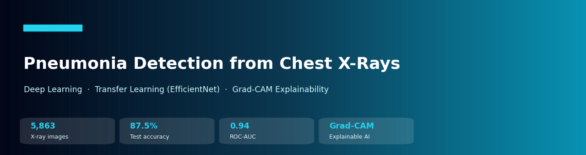
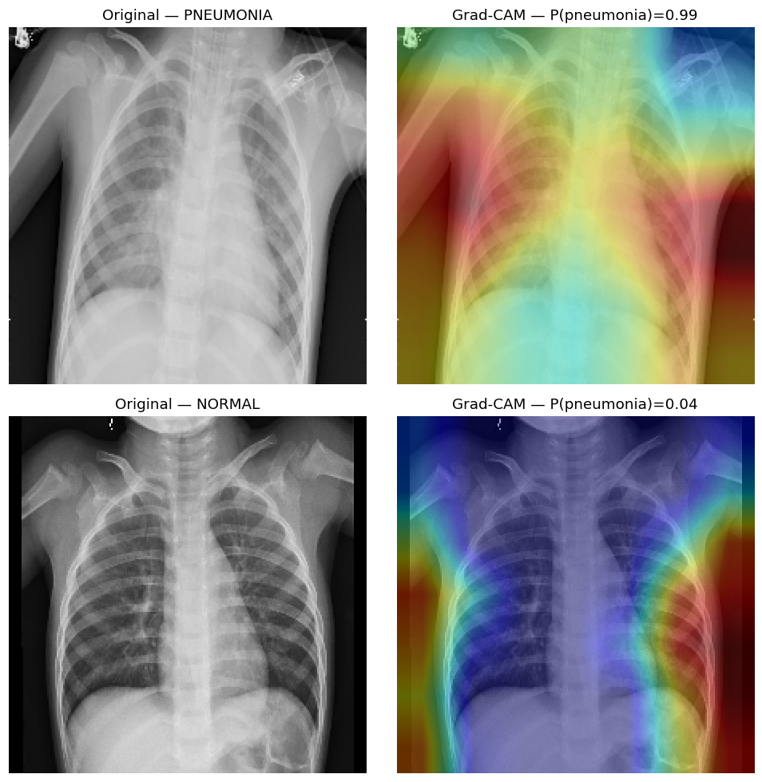
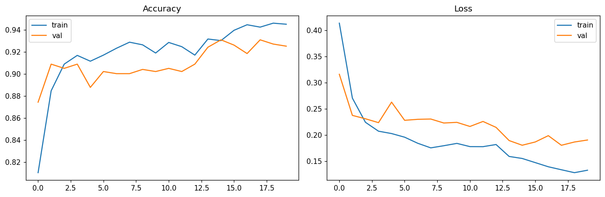
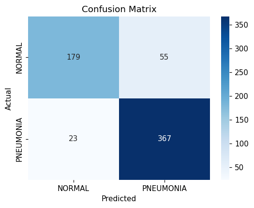
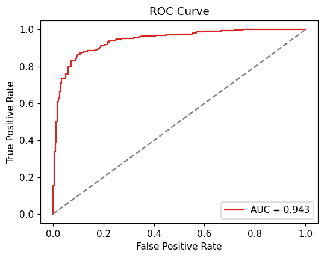
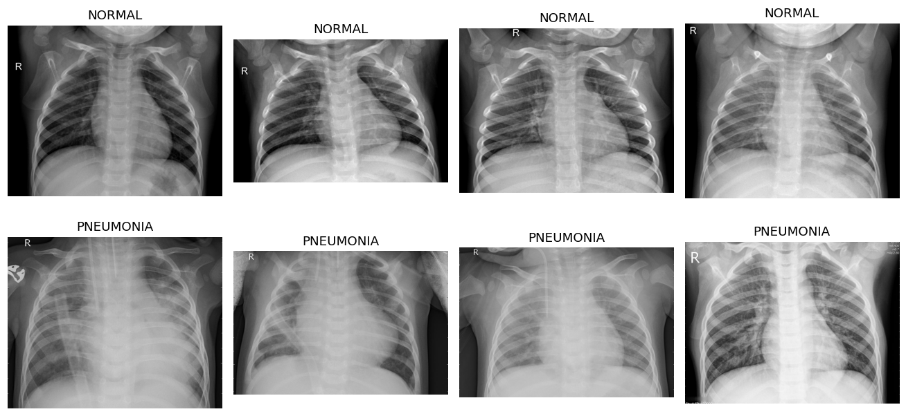

<div align="center">



# 🫁 Pneumonia Detection from Chest X-Rays

#### Deep Learning · Transfer Learning (EfficientNetB0) · Grad-CAM Explainability · Streamlit Demo

<br/>


<br/>

[-F9AB00?style=for-the-badge&logo=googlecolab&logoColor=white)](https://colab.research.google.com/github/AnkitSaxena-AI/chest-xray-pneumonia-detection/blob/main/notebooks/Pneumonia_Detection_Colab.ipynb)
[](https://chest-xray-pneumonia-detection-vvgz8gtbniravzkrv2fufx.streamlit.app/)

</div>

> ⚕️ **Disclaimer:** an educational deep-learning project — **not a medical device** and **not for diagnosis**.

---

## 📑 Table of Contents

<a id="toc"></a>

- [🎯 Overview](#overview)
- [🧩 Problem & Dataset](#problem)
- [🧠 Approach](#approach)
- [🔥 Grad-CAM — Explainability](#gradcam)
- [📈 Results](#results)
- [🖥️ Demo](#demo)
- [🗂️ Project Structure](#structure)
- [🚀 Getting Started](#getting-started)
- [👤 Author](#author)
- [📄 License](#license)

---

<a id="overview"></a>

## 🎯 Overview

Pneumonia is a leading cause of death worldwide, and chest X-rays are the primary diagnostic tool — but reading them
takes expertise that isn't always available. This project trains a **convolutional neural network** to classify chest
X-rays as **NORMAL** or **PNEUMONIA**, and — crucially — uses **Grad-CAM** to show *which regions* of the lung drove
each prediction, so the model is **interpretable**, not a black box.

**Highlights**
- 🧠 **Transfer learning** with EfficientNetB0 (ImageNet) + a custom classifier head, then fine-tuning.
- ⚖️ Handles **class imbalance** (class weights) and **augmentation** to fight overfitting.
- 🔥 **Grad-CAM** heatmaps for explainable predictions.
- 🖥️ An interactive **Streamlit** app: upload an X-ray → prediction + heatmap.

---

<a id="problem"></a>

## 🧩 Problem & Dataset

**Dataset:** [Chest X-Ray Images (Pneumonia)](https://www.kaggle.com/datasets/paultimothymooney/chest-xray-pneumonia) — **5,863** X-ray images (JPEG), split into train / val / test, two classes (NORMAL, PNEUMONIA). The set is **imbalanced** (more pneumonia than normal), which we address with class weights.

> The dataset isn't committed (it's large — download from Kaggle; see [Getting Started](#-getting-started)).

---

<a id="approach"></a>

## 🧠 Approach

```text
X-ray  →  resize 224×224  →  augmentation (flip / rotate / zoom)
       →  EfficientNetB0 (ImageNet, frozen)  →  GlobalAveragePooling  →  Dropout
       →  Dense(1, sigmoid)  →  P(pneumonia)
```

1. **Stage 1 — feature extraction:** freeze the EfficientNetB0 backbone, train only the new head.
2. **Stage 2 — fine-tuning:** unfreeze the top of the backbone (BatchNorm kept frozen) and train at a low learning rate.
3. **Class imbalance:** per-class weights so NORMAL isn't drowned out.
4. **Regularization:** augmentation, dropout, early stopping, LR scheduling.

---

<a id="gradcam"></a>

## 🔥 Grad-CAM — Explainability

Grad-CAM highlights the pixels that most influenced the prediction, overlaid on the X-ray — a sanity check that the
model focuses on **lung fields** (consolidation/opacities) rather than artifacts.

<p align="center"></p>

---

<a id="results"></a>

## 📈 Results

Evaluated on the held-out **test set (624 X-rays)** — EfficientNetB0 with fine-tuning:

| Metric | Score |
|---|:---:|
| Test Accuracy | **87.5%** |
| ROC-AUC | **0.943** |
| Recall — PNEUMONIA (sensitivity) | **0.941** |
| Precision — PNEUMONIA | **0.870** |
| F1 — PNEUMONIA | **0.904** |

> The model catches **94% of pneumonia cases** (high sensitivity — the metric that matters most for screening), at a test **ROC-AUC of 0.94**.

<table>
<tr>
<td width="50%"></td>
<td width="50%"></td>
</tr>
<tr>
<td width="50%"></td>
<td width="50%"></td>
</tr>
</table>

---

<a id="demo"></a>

## 🖥️ Demo

**▶ [Try the live demo →](https://chest-xray-pneumonia-detection-vvgz8gtbniravzkrv2fufx.streamlit.app/)** — no install, runs in your browser (upload an X-ray or pick a bundled sample).

The Streamlit app lets you upload any chest X-ray and get a prediction plus a Grad-CAM heatmap.

```bash
streamlit run app/app.py
```

> 💡 Upload any chest X-ray → get a NORMAL/PNEUMONIA prediction with confidence **and** a Grad-CAM heatmap (like the examples above).

---

<a id="structure"></a>

## 🗂️ Project Structure

```text
chest-xray-pneumonia-detection/
├── notebooks/
│   └── Pneumonia_Detection_Colab.ipynb   # 📓 Train on Colab GPU (data → model → Grad-CAM)
├── app/
│   ├── app.py                            # 🖥️ Streamlit demo
│   └── pneumonia_efficientnet.keras      # 🧠 Trained model
├── assets/                               # 🖼️ Banner + result figures
├── requirements.txt                      # 📦 Dependencies
├── STEPS.md                              # ✅ Exact run-it-yourself guide
└── LICENSE                               # 📄 MIT
```

---

<a id="getting-started"></a>

## 🚀 Getting Started

**Train the model (Google Colab — free GPU):**

1. Open the [training notebook in Colab](https://colab.research.google.com/github/AnkitSaxena-AI/chest-xray-pneumonia-detection/blob/main/notebooks/Pneumonia_Detection_Colab.ipynb) and set `Runtime → GPU`.
2. Upload your Kaggle API token (`kaggle.json`) when prompted — the notebook downloads the data, trains, evaluates, and produces Grad-CAM heatmaps.
3. It saves the model + figures and downloads `pneumonia_outputs.zip`.

**Run the demo locally:**

```bash
git clone https://github.com/AnkitSaxena-AI/chest-xray-pneumonia-detection.git
cd chest-xray-pneumonia-detection
pip install -r requirements.txt
streamlit run app/app.py
```

See **[`STEPS.md`](STEPS.md)** for the exact, copy-paste runbook.

---

<a id="author"></a>

## 👤 Author

**Ankit Saxena** — *Data Science & AI*

[](https://github.com/AnkitSaxena-AI)
[](https://linkedin.com/in/ankitsaxenadsai)
[](https://kaggle.com/ankitsaxenaai)
[](mailto:ankitsaxenadsai@gmail.com)

> ⭐ If you found this useful, please star the repo!

---

## 🙏 Acknowledgements

- Dataset: **Kermany et al.** via [Kaggle — Chest X-Ray Images (Pneumonia)](https://www.kaggle.com/datasets/paultimothymooney/chest-xray-pneumonia)
- Backbone: **EfficientNet** (Tan & Le, 2019) · Explainability: **Grad-CAM** (Selvaraju et al., 2017)

<a id="license"></a>

## 📄 License

Released under the **MIT License** — see [`LICENSE`](LICENSE).

<div align="center">

---

*Built with TensorFlow/Keras, Grad-CAM & Streamlit · © 2026 Ankit Saxena*
*Educational project — not for clinical use.*

[⬆ Back to top](#toc)

</div>
